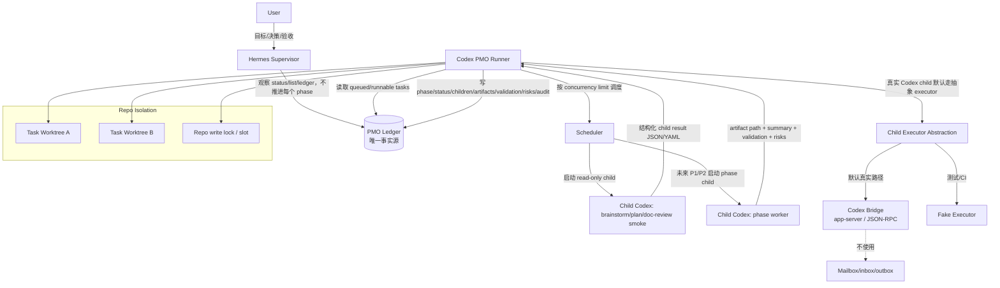
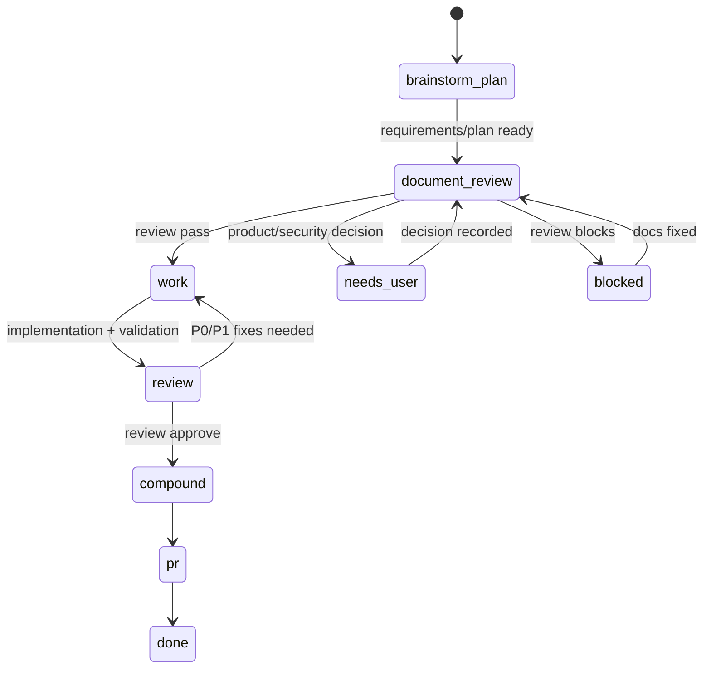
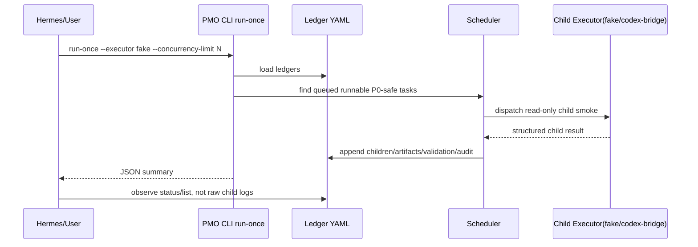

# DEM-013 Codex PMO Ledger Runner 架构图

## 总览

## Phase 状态机

## P0 已实现能力

## 控制面原则

PMO/Hermes 只看：

- completion event
- structured status
- ledger delta
- artifact path
- validation summary
- risks / decisions_needed

禁止把 raw child logs/transcripts 作为常规控制面。
